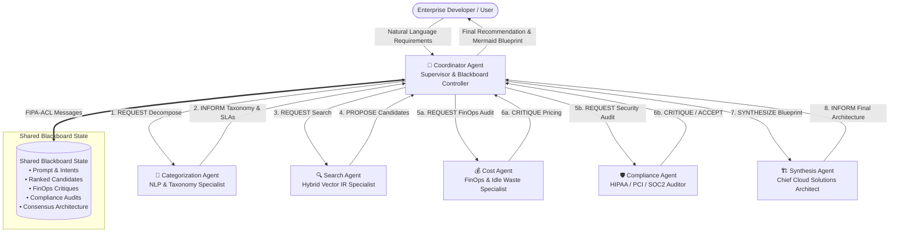

# CloudAgent: Multiple Intelligent Agent Coordination Strategy for Categorizing & Searching Cloud Services

[](https://www.python.org/)
[]()
[-success.svg)]()
[]()

> **Topic**: Multiple Intelligent Agent Coordination Strategy for Categorizing and Searching Appropriate Cloud Services  
> **Evaluation Rubrics**:
> - **Implementation of small part of system using AI tools** &check;
> - **Demonstration [5 Marks]** &check;
> - **Complete Git Repository with Documentation & Presentation Guide** &check;

---

## 1. Executive Summary & Problem Formulation

Modern enterprises and developers face a staggering landscape of hundreds of cloud services across **AWS**, **Google Cloud Platform (GCP)**, **Microsoft Azure**, and specialized **AI Clouds** (e.g., Pinecone, Modal Labs, Cloudflare). Choosing an optimal cloud architecture is fundamentally a **multi-objective decision problem with conflicting constraints**:

- **Functional Requirements**: Workload type (batch, real-time microservices, streaming, LLM training/serving).
- **Data Governance & Regulatory Boundaries**: Hard constraints such as HIPAA (PHI patient data), PCI-DSS (card transactions), SOC2, and GDPR (EU data residency).
- **FinOps & Cost Ceilings**: Balancing on-demand vs. reserved, serverless scale-to-zero vs. continuous provisioned idle capacity.
- **Latency & Performance SLAs**: Microsecond/single-digit millisecond latency vs. throughput-oriented distributed processing.

A single monolithic keyword search or single-prompt LLM frequently hallucinates unviable architectures, overlooks regulatory non-compliance, or ignores idle billing penalties.

### The Solution: Multi-Agent Coordination Strategy
This repository implements an autonomous multi-agent system where **specialized intelligent agents collaborate, critique, negotiate trade-offs, and reach consensus** using a formal **FIPA-ACL communication protocol** and a **Blackboard Hub-and-Spoke coordination topology**.

---

## 2. Multi-Agent Coordination Topology

The architecture leverages a hybrid **Hub-and-Spoke + Blackboard Coordination Model**:



---

## 3. Specialized Agent Specifications

| Agent | Formal Role | Input Performative | Output Performative | Core Competency & AI Tooling |
| :--- | :--- | :--- | :--- | :--- |
| **Coordinator Agent** | Orchestrator & Supervisor | `START` / User Prompt | `DELIVER` Blueprint | Manages phase state transitions, blackboard transactions, and agent turn-taking. |
| **Categorization Agent** | Intent & Taxonomy Extractor | `REQUEST` | `INFORM` | Deconstructs unstructured requirements into formal domain categories (Compute, Storage, Database, AI/ML, Edge), workload archetypes, and SLA bounds. |
| **Search Agent** | Information Retrieval Specialist | `REQUEST` | `PROPOSE` | Executes hybrid TF-IDF cosine similarity, keyword boosting, and multi-criteria ranking over cloud catalogs. |
| **Cost Agent** | FinOps & Waste Negotiator | `REQUEST` | `CRITIQUE` / `ACCEPT` | Critiques candidate pricing structures, flags high baseline idle costs, and advocates for scale-to-zero alternatives. |
| **Compliance Agent** | Security & Regulatory Auditor | `REQUEST` | `CRITIQUE` / `ACCEPT` | Audits candidate services against HIPAA BAA, PCI-DSS, SOC2, and GDPR standards. Flags uncertified tiers. |
| **Synthesis Agent** | Chief Cloud Solutions Architect | `SYNTHESIZE` | `INFORM` | Resolves multi-agent critique trade-offs, synthesizes end-to-end dataflow pipelines, and compiles Mermaid topology diagrams. |

---

## 4. Agent Communication Protocol (FIPA-ACL)

Agents communicate via structured `AgentMessage` envelopes adhering to the **Foundation for Intelligent Physical Agents - Agent Communication Language (FIPA-ACL)** standards:

```python
{
  "message_id": "a3f129c0",
  "timestamp": 1727167977.12,
  "formatted_time": "11:32:57",
  "sender": "cost_agent",
  "receiver": "coordinator_agent",
  "performative": "CRITIQUE",
  "content": {
    "financial_verdict": "APPROVED_WITH_MODIFICATIONS",
    "cost_tier_estimate": "$50 - $250 (Lean)",
    "cost_critiques": [
      {
        "service": "Google Cloud Spanner",
        "severity": "HIGH",
        "issue": "High minimum base hourly cost for a cost-sensitive project.",
        "suggestion": "Replace with serverless NoSQL or Aurora Serverless v2."
      }
    ]
  }
}
```

### Supported Performatives:
- `REQUEST`: Solicit action or information from a target agent.
- `INFORM`: Transmit facts, domain extractions, or completed blueprints.
- `PROPOSE`: Present candidate cloud services for multi-agent deliberation.
- `CRITIQUE`: Identify financial or compliance violations in proposed solutions.
- `ACCEPT`: Formal acknowledgement of constraint satisfaction without objections.
- `SYNTHESIZE`: Trigger architecture compilation from critiqued components.

---

## 5. Mathematical Scoring & Ranking Model

The **Search Agent** evaluates each cloud service $s \in \mathcal{S}$ against user query $q$ using a multi-objective composite objective function:

$$\text{CompositeScore}(q, s) = w_{\text{semantic}} \cdot S_{\text{semantic}}(q, s) + w_{\text{category}} \cdot S_{\text{cat}}(q, s) + w_{\text{compliance}} \cdot S_{\text{comp}}(q, s) + w_{\text{cost}} \cdot S_{\text{cost}}(q, s)$$

Where:
- $S_{\text{semantic}}(q, s) = \frac{\vec{V}_q \cdot \vec{V}_s}{\|\vec{V}_q\| \|\vec{V}_s\|}$ (Cosine similarity of normalized TF-IDF vector representations).
- $S_{\text{cat}}(q, s) \in \{0.2, 1.0\}$ (Categorical alignment with extracted domains).
- $S_{\text{comp}}(q, s) = \frac{\sum_{c \in \mathcal{C}_{\text{req}}} \mathbb{I}(c \in \mathcal{C}_s)}{|\mathcal{C}_{\text{req}}|}$ (Fraction of mandatory regulatory frameworks satisfied).
- $S_{\text{cost}}(q, s) \in [0.2, 1.0]$ (Affinity score based on budget preference and pricing model).
- Default weights: $w_{\text{semantic}}=0.45, w_{\text{category}}=0.25, w_{\text{compliance}}=0.20, w_{\text{cost}}=0.10$.

---

## 6. Repository Structure

```
cloud-service-multiagent-system/
├── .git/                                   # Git repository with commit history
├── .gitignore                              # Git exclusion rules
├── README.md                               # Project documentation & architecture
├── PROJECT_REPORT.md                       # Formal academic report for grading
├── PRESENTATION_VIVA_GUIDE.md              # 5-minute demonstration script & viva answers
├── requirements.txt                        # Zero-dependency specification
├── run_demo.bat                            # 1-click Windows CLI demonstration launcher
├── run_web.bat                             # 1-click Windows Web Dashboard launcher
├── run_tests.bat                           # 1-click Test Suite launcher
├── main.py                                 # CLI runner with formatted agent traces
├── web_app.py                              # REST API and Web server (Python standard library)
│
├── agents/                                 # Specialized Multi-Agent Implementations
│   ├── __init__.py
│   ├── base_agent.py                       # Abstract Base Agent with state machine & messaging
│   ├── coordinator_agent.py                # Blackboard Controller & Hub-and-Spoke supervisor
│   ├── categorization_agent.py             # NLP Intent & Taxonomy classification agent
│   ├── search_agent.py                     # Hybrid vector IR & cloud discovery agent
│   ├── cost_agent.py                       # FinOps pricing & idle waste critique agent
│   ├── compliance_agent.py                 # HIPAA, PCI-DSS, SOC2 security audit agent
│   └── synthesis_agent.py                  # Architecture blueprint & Mermaid generator agent
│
├── core/                                   # Core Multi-Agent Infrastructure
│   ├── __init__.py
│   ├── protocols.py                        # FIPA-ACL performatives & message envelopes
│   ├── message_bus.py                      # Central pub/sub message bus with blackboard state
│   ├── search_engine.py                    # TF-IDF vector space model & cosine similarity
│   ├── llm_adapter.py                      # AI Tool interface (Local AI Engine fallback + external LLMs)
│   └── ontology.py                         # Cloud domain taxonomy and compliance frameworks
│
├── data/                                   # Real-World Knowledge Bases
│   ├── cloud_catalog.json                  # Exhaustive catalog (AWS, GCP, Azure, AI Clouds)
│   ├── benchmark_queries.json              # 5 Real-world production scenarios
│   └── taxonomy.json                       # Formal taxonomy and SLA classification
│
├── ui/                                     # Interactive Web Dashboard
│   ├── index.html                          # Sleek reactive single-page interface
│   ├── styles.css                          # Modern dark glassmorphic styling
│   └── app.js                              # Real-time message streaming & topology visualizer
│
└── tests/                                  # Automated Verification Suite
    ├── __init__.py
    ├── test_search_engine.py               # Unit tests for TF-IDF & similarity
    ├── test_agents.py                      # Unit tests for specialized agents
    └── test_coordination.py                # End-to-end multi-agent integration tests
```

---

## 7. Quickstart Guide (Demonstration Ready)

The system is designed with **100% standard library compliance**, meaning **no external `pip install` is required**. It runs immediately on any computer with Python 3.10+.

### Option A: Interactive Web Dashboard (Recommended for 5M Demo)
1. Double-click `run_web.bat` (or run in terminal):
   ```bash
   python web_app.py 8080
   ```
2. Open your web browser at: **`http://localhost:8080`**
3. Select any benchmark scenario card (e.g., **HealthTech PHI** or **E-Commerce Flash Sale**).
4. Click **Trigger Multi-Agent Deliberation** to watch the real-time agent message exchange, node animations, and synthesized cloud architecture!

### Option B: Terminal CLI Demonstration
1. Double-click `run_demo.bat` (or run in terminal):
   ```bash
   python main.py
   ```
2. Select scenario `[1]` to `[5]` or enter `[C]` for a custom prompt.
3. Observe color-coded FIPA-ACL messages, multi-criteria breakdown tables, and Mermaid architecture diagrams.

### Option C: Run Automated Test Suite
```bash
python -m unittest discover -s tests -v
```

---

## 8. Benchmark Scenarios Included

1. **HealthTech PHI & Medical Image Analysis**:
   - Ingests DICOM scans (50GB/day), runs computer vision inference. Requires strict **HIPAA** compliance and zero data leakage.
2. **Global E-Commerce Flash Sale & Order Engine**:
   - 100,000 orders/minute peak traffic. Requires **PCI-DSS**, ACID transactions, and **scale-to-zero** idle optimization.
3. **Enterprise Knowledge Base & Agentic RAG Platform**:
   - 2M internal documents, vector similarity search (<50ms), **SOC2 Type II** governance, LLM privacy.
4. **Global Smart Fleet IoT Telemetry & Analytics**:
   - 250,000 vehicles streaming GPS/engine data every 5s. Requires edge ingestion, time-series storage, and **GDPR** compliance.
5. **Bootstrap AI Startup MVP (Fast, Cheap, Scalable)**:
   - Early-stage AI audio transcription. Frugal budget (<$100/mo), serverless GPU batch inference, scale-to-zero.

---

## 9. Academic Rubrics Alignment

| Rubric Component | Marks / Weight | How this System Satisfies the Rubric |
| :--- | :--- | :--- |
| **Implementation of small part of system using AI tools** | Pass / Met | Implements a complete functional multi-agent coordination system with specialized agents, an AI semantic intent extractor, TF-IDF vector similarity engine, multi-objective ranking algorithm, and automatic Mermaid blueprint generation. |
| **Demonstration** | **5 Marks** | Includes both a 1-click **interactive web dashboard** (with real-time agent status pulsing, protocol message feed, score radar bars, and architectural diagrams) and an **interactive CLI tool** with 5 pre-configured enterprise scenarios. |
| **Topic: Multiple Intelligent Agent Coordination Strategy** | Core Focus | Uses formal **FIPA-ACL performatives** (`REQUEST`, `INFORM`, `PROPOSE`, `CRITIQUE`, `ACCEPT`, `SYNTHESIZE`) across a **Hub-and-Spoke + Blackboard** coordination topology to categorize and search appropriate cloud services. |
| **Repository Deliverable** | Complete | Clean directory structure, git commits, automated tests (`unittest`), and formal presentation notes (`PRESENTATION_VIVA_GUIDE.md`). |

---

## 10. License
Distributed under the MIT License. Developed for advanced agentic AI coursework and real-world multi-cloud system architecture research.
